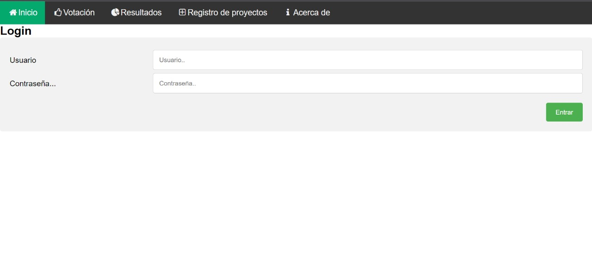
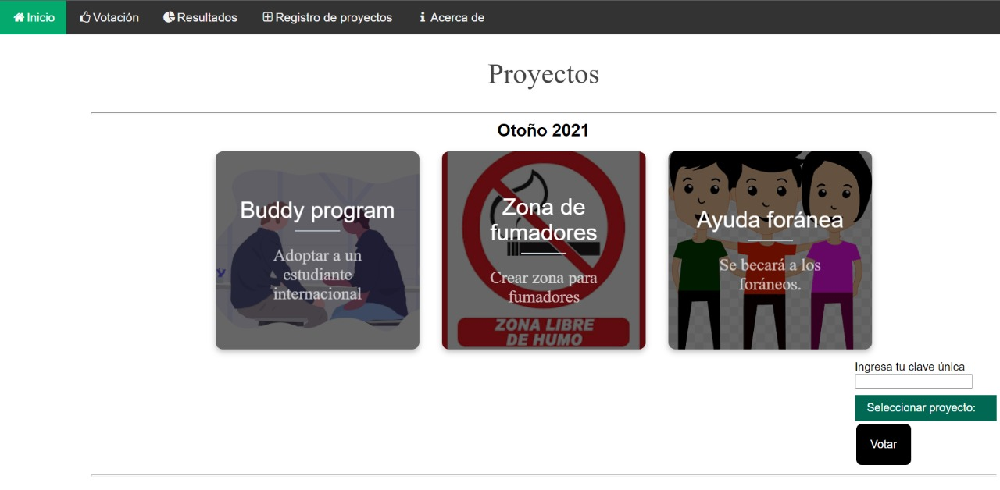
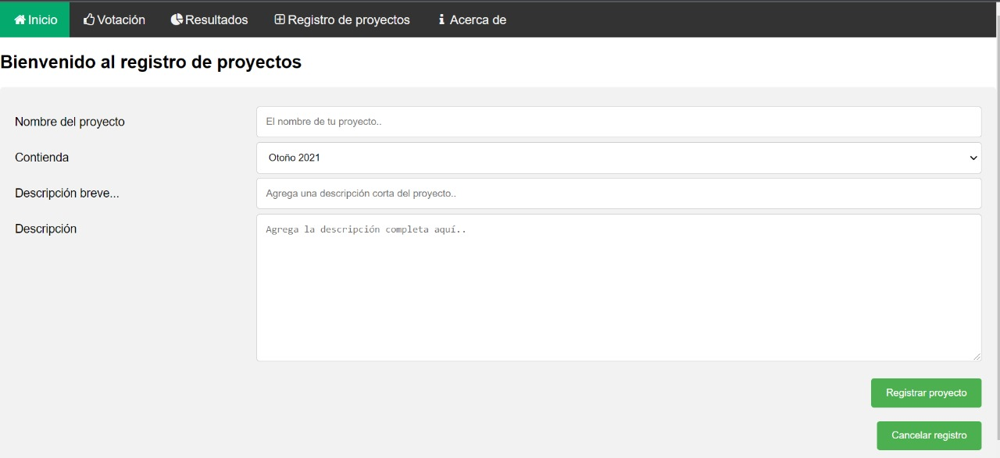
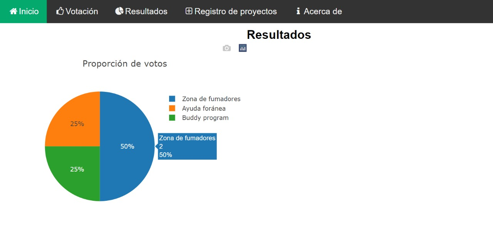

# Software Requirements Specification

# Tabla de Contenido
1. [Introducción](#introduction)
2. [Descripción General](#overall-description)
3. [Requerimiento de Interfaz Externo](#external-interface-requirement)
4. [Features del Sistema](#system-features)
5. [Otros Requerimientos No-Funcionales](#other-nonfunctional-requirements)
6. [Otros Requerimientos](#other-requirements)

## 1. Introducción 
### 1.1 Propósito
El propósito de este documento es la creación de una aplicación para el Instituto Tecnológico Autónomo de México que permita que los y las estudiantes de la universidad voten para elegir proyectos que se llevarán a cabo dentro de la institución. El objetivo principal es ayudar a facilitar la elección de proyectos nuevos.

### 1.2 Convenciones del Documento

| Término  | Convención  |
|---|---|
| Instituto Tecnológico Autónomo de México  | ITAM  |
| Base de Datos  | BD  |
| Cosa  | Coso  |

### 1.3 Audiencia Destinataria y Sugerencias de Lectura

Este documento esta destinado a desarolladores, project managers y a usuarios. La audiencia principal de este documento son los desarolladores que crearan y mantedrán el producto. Sin embargo, también es útil tanto para los estudiantes como para los integrantes de la administración del ITAM que desean publicar proyectos dentro de la plataforma. Para aquellos con tiempo, sugerimos que lean el documento de principio a fin. Para aquellos con menos tiempo, la sección mas pertinente es la de [Features del Sistema](#system-features).

### 1.4 Definición (Scope) del Producto

El propósito de esta aplicación es facilitar la votación y elección de proyectos propuestos por la administración del ITAM. Se requiere que sea conveniente y fácil de usar. Adicionalmente permite que el cuerpo estudiantil participe de manera más activa en la toma de decisiones dentro de su universidad, fomentando un ambiente democrático.

## 2. Descripción General
### 2.1 Perspectiva del Producto

El propósito de este producto es proveer a los estudiantes del ITAM con más facultades para influir en el proceso de decisiones de la administración de la institución. Este producto existe dentro del contexto de una variedad de aplicaciones que utilizán los estudiantes del ITAM, las dos más importantes siendo Canvas y Grace. Este producto sería un producto nuevo y autónomo, pero que utilizaría el mismo login usuario y password que el sistema de Grace. El username siendo la clave única del estudiante mientras que el password incial sería el NIP que recibes al ingresar a la universidad en primer semestre.

### 2.2 Funciones del Producto

El producto tendrá dos tipos de usuarios, estudiante y administrador. 

Funciones de Estudiante:
- Login a su cuenta.
- Votar por el proyecto deseado.
- Observar los resultados de una votación.

Funciones de Administrador:
- Login a su cuenta.
- Comenzar una campaña nueva de votación.
- Añadir opciones a una campaña de votación (con nombre, descripción y/o imágenes).
- Concluir una campaña de votación.
- Observar los resultados de una votación.

### 2.3 Clases de Usuario y Características

Como fue mencionado previamente, habrá dos tipos de usuarios: estudiante y administrador. Es más importante satisfacer las necesidades del usuario tipo estudiante ya que habrá mucho más usuarios en esta categoría. El usuario administrador debería tener acceso a todas las funciones del producto.

### 2.4 Entorno de Operación

El entorno de operación del sistema de votación esta listado debajo:

- BD distribuida
- Sistema tipo Client/Server
- Sistema Operativo: Windows
- BD: Derby
- Plataforma: Java/JavaScript
- Arquitectura: Microservicios y Space-Based.

La aplicación solamente tendría que ser una "web-app" ya que no se utilizaría tan seguído por los usuarios y porque no hay necesidad de que sea híper-accesible.

### 2.5 Limitaciones de Diseño e Implementación

1. Los commandos de Derby para los queries e aplicaciones del producto.
2. Políticas de confidencialidad de datos de la institución (ITAM).
3. Limitaciones de una BD distribuida (mayor complejidad).
4. Limitaciones de una arquitectura de Microservicios (performance).
5. Limitaciones de una arquitectura Space-Based (testability y development).

### 2.6 Suposiciones y Dependencias

1. La creación de este sistema opera bajo la suposición de que el ITAM tiene una BD con las claves únicas y los NIPs de cada alumno del ITAM. Sin esta BD el producto se vería afectado y se tendría que generar una BD de usuarios para constituir los logins.
2. Adicionalmente, se trabaja bajo la suposición de que dicha BD contiene información para verificar que el alumno sigue inscrito en el ITAM.
3. Finalmente se asume que el backend del producto se mantedrá de manera adecuada.

## 3. Requerimiento de Interfaz Externo
### 3.1 Interfaces de Usuario

El producto tendrá cuatro interfaces principales para los usuarios:

- Página de Login:

- Página de Votación de Proyectos:

- Página de Registro de Proyectos Nuevos (sólo para usuarios tipo administrador):

- Página de Vista de Resultados:

También se desea que haya un menú en la parte superior de cada una de las página para que el usuario pueda navegar a través de todas las funcionalidades de el producto.

### 3.2 Interfaces de Hardware

El producto solo será accesible a través de un navegador web que este instalado dentro de una computadora tradicional u otro dispositivo electrónico como un smartphone o tablet. No hay planes para crear una versión móvil del producto como se hace a veces para algunas páginas web.

### 3.3 Interfaces de Software

El producto se accesará a través de un navegador web ya que será una "web app."

<Describe the connections between this product and other specific software components (name and version), including databases, operating systems, tools, libraries, and integrated commercial components. Identify the data items or messages coming into the system and going out and describe the purpose of each. Describe the services needed and the nature of communications. Refer to documents that describe detailed application programming interface protocols. Identify data that will be shared across software components. If the data sharing mechanism must be implemented in a specific way (for example, use of a global data area in a multitasking operating system), specify this as an implementation constraint.>

### 3.4 Interfaces de Comunicación

<Describe the requirements associated with any communications functions required by this product, including e-mail, web browser, network server communications protocols, electronic forms, and so on. Define any pertinent message formatting. Identify any communication standards that will be used, such as FTP or HTTP. Specify any communication security or encryption issues, data transfer rates, and synchronization mechanisms.>

## 4. Features del Sistema

### 4.1 Feature 1: Login

### 4.1.1 Descripción y Prioridad

Esta funcionalidad se refiere a que un usuario (ya sea estudiante o administrador) pueda ingresar a su cuenta dentro del producto. Esta funcionalidad tiene prioridad alta o de tipo 1 ya que es indispensable para que un usuario pueda llevar a cabo acciónes dentro del producto. Es increíblemente importante que exista **rendición de cuentas** dentro de este producto. Un buen sistema de **rendición de cuentas** permitirá que cada voto sea contado y relacionado a un usuario específico, así evitando fraudes en votaciones.

### 4.1.2 Secuencias de Estímulo/Respuesta

| Estímulo  | Respuesta  |
|---|---|
| El usuario ingresa su nombre de usuario (clave única) y contraseña (NIP) en los renglones correspondientes. Presiona el botón "Entrar." | El producto lleva al usuario a la página de inicio de la aplicación. El producto lo tiene identificado como el usuario correspondiente a la tupla de nombre de usuario y contraseña ingresada.  |

### 4.1.3 Requerimientos Funcionales

**REQ-1-1:** El sistema tiene acceso a la BD de usuarios de la aplicación. Dicha BD esta compuesta por, al menos: nombres de usuario (claves únicas), contraseñas, tipos de usuario (administrador o estudiante), y en el caso de ser estudiante si siguen dados de alta dentro del ITAM.

**REQ-1-2:** El sistema no permite acceso al usuario si la combinación de nombre de usuario y contraseña no está dentro de la BD.

**REQ-1-3:** El sistema bloquea la habilidad de ingresar nombres de usuarios/contraseñas nuevas después de 5 intentos fallidos por un determinado tiempo. Este requerimiento añade seguridad al sistema y evita que alguien pueda accesar la cuenta de otro usuario a través de "brute-forcing."

**REQ-1-4:** El sistema no permite acceso al usuario si la BD indica que el usuario es un estudiante que esta dado de baja en el ITAM. Despliega un mensaje correspondiente.

### 4.2 Feature 2: Votar para el proyecto deseado

### 4.2.1 Descripción y Prioridad

Esta funcionalidad se refiere a que un usuario, del tipo estudiante, pueda votar a favor de el proyecto que deseé. Evidentemente, esta funcionalidad tiene prioridad alta o de tipo 1 ya que es indispensable para que el producto haga lo que debe de hacer.

### 4.2.2 Secuencias de Estímulo/Respuesta

| Estímulo  | Respuesta  |
|---|---|
| El usuario ingresa su clave única a una caja de texto, elige el proyecto deseado de un "drop-down list" y presiona el botón de "Votar". | El producto registra el voto del usuario dentro de la BD y despliega un mensaje de confirmación.  |

### 4.2.3 Requerimientos Funcionales

**REQ-2-1:** El sistema tiene acceso a la BD de usuarios de la aplicación, previamente mencionada en REQ-1-1.

**REQ-2-2:** El sistema tiene acceso (con habilidad para modificar) a la BD de votos, que registra cuantos votos recibe cada proyecto.

**REQ-2-3:** El sistema no permite que el mismo usuario vote más de una vez.

### 4.3 Feature 3: Crear proyectos nuevos

### 4.3.1 Descripción y Prioridad

Esta funcionalidad se refiere a que un usuario, del tipo administrador, pueda añadir un proyecto nuevo a una contienda existente. El administrador debe poder asignar un nombre, descripción breve, descripción completa e imágen a las caracterísitcas de dicho proyecto nuevo, para que los usuarios estudiantes entiendan por qué proyecto están votando. Evidentemente, esta funcionalidad tiene prioridad alta o de tipo 1 ya que es indispensable para que el producto haga lo que debe de hacer. Sin esta funcionalidad los usuarios tipo estudiante no podrían votar por algún proyecto.

### 4.3.2 Secuencias de Estímulo/Respuesta

| Estímulo  | Respuesta  |
|---|---|
| Dentro de las cajas de texto correspondientes, el usuario ingresa el nombre del proyecto, la contienda, la descripción breve, y la descripción completa del proyecto. El usuario presiona el botón "Registrar proyecto". | El producto añade el proyecto nuevo y sus características a la base de datos de proyectos y lo despliega en la contienda especificada. Ahora los usuarios tipo estudiante podrán votar por dicho proyecto.  |

### 4.3.3 Requerimientos Funcionales

**REQ-3-1:** El sistema tiene acceso a la BD de usuarios de la aplicación, previamente mencionada en REQ-1-1.

**REQ-3-2:** El sistema tiene acceso (con habilidad para modificar) a la BD de proyectos, que registra las características de cada proyecto.

**REQ-3-3:** El sistema solo permite que los usuarios tipo administrador utilizen esta funcionalidad.

**REQ-3-4** Para permanecer apegado al requerimiento de **autorización**, el sistema verifica, con la BD mencionada en REQ-3-1, que el usuario es del tipo administrador, antes de llevar a cabo cambios.

## 5. Otros Requerimientos No-Fucnionales

### 5.1 Performance Requirements
If there are performance requirements for the product under various circumstances, state them here and explain their rationale, to help the developers understand the intent and make suitable design choices. Specify the timing relationships for real time systems. Make such requirements as specific as possible. You may need to state performance requirements for individual functional requirements or features.
### 5.2 Safety Requirements

<Specify those requirements that are concerned with possible loss, damage, or harm that could result from the use of the product. Define any safeguards or actions that must be taken, as well as actions that must be prevented. Refer to any external policies or regulations that state safety issues that affect the product’s design or use. Define any safety certifications that must be satisfied.>

### 5.3 Security Requirements

Specify any requirements regarding security or privacy issues surrounding use of the product or protection of the data used or created by the product. Define any user identity authentication requirements. Refer to any external policies or regulations containing security issues that affect the product. Define any security or privacy certifications that must be satisfied.

### 5.4 Software Quality Attributes

<Specify any additional quality characteristics for the product that will be important to either the customers or the developers. Some to consider are: adaptability, availability, correctness, flexibility, interoperability, maintainability, portability, reliability, reusability, robustness, testability, and usability. Write these to be specific, quantitative, and verifiable when possible. At the least, clarify the relative preferences for various attributes, such as ease of use over ease of learning.>

### 5.5 Business Rules
List any operating principles about the product, such as which individuals or roles can perform which functions under specific circumstances. These are not functional requirements in themselves, but they may imply certain functional requirements to enforce the rules.

## 6. Otros Requerimientos 

Define any other requirements not covered elsewhere in the SRS. This might include database requirements, internationalization requirements, legal requirements, reuse objectives for the project, and so on. Add any new sections that are pertinent to the project.
